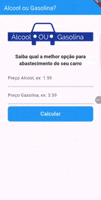

# ⛽ Alcool ou Gasolina? - Calculadora de Abastecimento

O **Meu Combustível** é um projeto desenvolvido em Flutter para auxiliar motoristas na tomada de decisão econômica no posto de combustível. O foco principal foi o gerenciamento de entradas de dados, tratamento de erros de conversão e experiência do usuário (UX).

## 📱 Demonstração

| App em Funcionamento                                                                   | Descrição |
|:---------------------------------------------------------------------------------------| :--- |
|  | **Cálculo Inteligente:**    • Conversão automática de strings para valores numéricos.   • Aceita tanto ponto quanto vírgula (formatação brasileira).   • Feedback visual imediato com a melhor opção.    _Fórmula: (Preço Álcool / Preço Gasolina) >= 0.7_ |

---

## ✨ Funcionalidades

- **Tratamento de Input:** O sistema limpa automaticamente os campos de texto após o cálculo para facilitar uma nova consulta.
- **UX Reativa:** Ao clicar em calcular, o teclado é ocultado automaticamente (`unfocus`) para que o resultado fique visível sem obstruções.
- **Validação de Dados:** Impede cálculos com valores vazios, nulos ou negativos, orientando o usuário com mensagens de erro claras.

## 🛠️ Tecnologias e Conceitos Aplicados

- **TextEditingController:** Gerenciamento preciso dos estados dos campos de entrada.
- **Null Safety:** Implementação de `double.tryParse` com verificações de nulidade para evitar falhas em tempo de execução.
- **Layout Adaptativo:** Uso de `SingleChildScrollView` para garantir que o layout se ajuste perfeitamente quando o teclado virtual é acionado.
- **Widgets de UI:** Estilização moderna com `ElevatedButton` e `InputDecoration` seguindo padrões do Material Design.

---

### 🛠️ Como executar o projeto

1. Certifique-se de ter o **Flutter SDK** instalado.
2. Clone o repositório.
3. Certifique-se de que o arquivo `logo.png` está na pasta `images/`.
4. Execute `flutter pub get`.
5. Rode o projeto com `flutter run`.

---